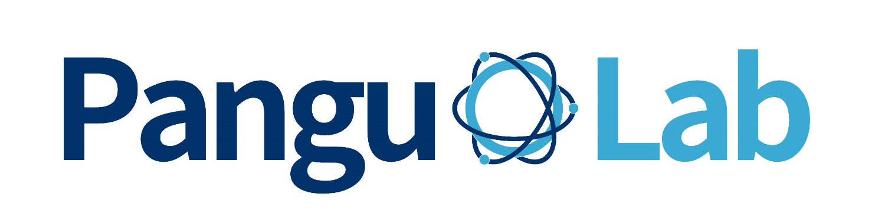

### :bowtie: Hi, I'm Pengzhan Zhao 
👋 Welcome~!

## About me
🌱 Lecturer  
:school: Hebei Normal University  

### Research interests
:books: Quantum Computing, Software Testing, Quantum Machine Learning

### Publications

[:link:](https://authors.elsevier.com/c/1hWfxbKHpCdUL) Zhao, P., Miao, Z., and Lan, S., Zhao, J. Bugs4Q: A benchmark of existing bugs to enable controlled testing and debugging studies for quantum programs,
Journal of Systems and Software, Volume 205, 2023, 111805, ISSN 0164-1212.

[:link:](https://arxiv.org/abs/2306.06369) Zhao, P.,  Wu, X., Luo, J., Li, Z., Zhao, J. (2023, July). An Empirical Study of Bugs in Quantum Machine Learning Frameworks.
Best student paper  of the IEEE International Conference on Quantum Software (QSW 2023) (pp. 68-75).

[:link:](https://arxiv.org/abs/2304.04387) Zhao, P.,  Wu, X., Li, Z., Zhao, J. (2023, May). QChecker: Detecting Bugs in Quantum Programs via Static Analysis.
The 4th International Workshop on Quantum Software Engineering (Q-SE 2023) (pp. 50-57).

[:link:](https://ieeexplore.ieee.org/abstract/document/9474564) Zhao, P., Zhao, J., and Ma, L. (2021, June). Identifying bug patterns in quantum programs. In 2021 IEEE/ACM 2nd International Workshop on Quantum Software Engineering (Q-SE 2021) (pp. 16-21). IEEE.  

[:link:](https://ieeexplore.ieee.org/abstract/document/9678908) Zhao, P., Zhao, J., Miao, Z., and Lan, S. (2021, November). Bugs4Q: A benchmark of real bugs for quantum programs. In 2021 36th IEEE/ACM International Conference on Automated Software Engineering (ASE 2021) (pp. 1373-1376). IEEE.

[:link:](https://www.computer.org/csdl/proceedings-article/saner/2022/378600b239/1FbT6n3hGaA) J. Luo, P. Zhao, Z. Miao, S. Lan and J. Zhao, "A Comprehensive Study of Bug Fixes in Quantum Programs," in 2022 IEEE International Conference on Software Analysis, Evolution and Reengineering (Q-SANER 2022), Honolulu, HI, USA, 2022 (pp. 1239-1246).

[:link:](https://dl.acm.org/doi/abs/10.1145/3643667.3648223) X. Guo, J. Zhao, P. Zhao, (2024, April). On repairing quantum programs using ChatGPT. In Proceedings of the 5th ACM/IEEE International Workshop on Quantum Software Engineering (pp. 9-16).

[:link:](https://kyushu-u.elsevierpure.com/en/publications/improving-adversarial-training-for-two-player-competitive-games-v/) S. Chen, F. Zhang, Z. Li, X. Wu, J. Chen, P. Zhao & J. Zhao   (2024, April). Improving Adversarial Training for Two-player Competitive Games via Episodic Reward Engineering. Transactions on Machine Learning Research, 2025.

<!--
**Z-928/Z-928** is a ✨ _special_ ✨ repository because its `README.md` (this file) appears on your GitHub profile.

Here are some ideas to get you started:

- 🔭 I’m currently working on ...
- 🌱 I’m currently learning ...
- 👯 I’m looking to collaborate on ...
- 🤔 I’m looking for help with ...
- 💬 Ask me about ...
- 📫 How to reach me: ...
- 😄 Pronouns: ...
- ⚡ Fun fact: ...
-->
### Education
:necktie: Ph.D. Degree from Kyushu University, supervised by [Prof. Jianjun Zhao](http://stap.ait.kyushu-u.ac.jp/~zhao/)  
:mortar_board: M.S. Degree from Hebei Normal University, supervised by Prof. Jinghong Wang
